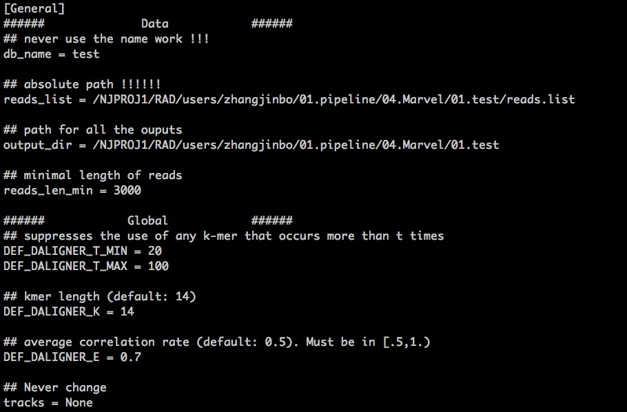
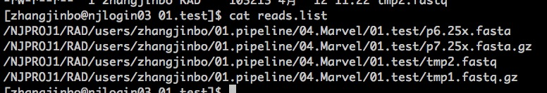

.. _ConfigandUsage:

Config and Usage
================================================================================

.. _PrepareConfig:

Prepare Config file
--------------------------------------------------------------------------------

First, you have to prepare a \'config\.cfg\', which contains the informations run_marvel requires to fish all the tasks. You can just copy the \'config\.cfg\' from the run_marvel folder and alter the necessary items just as following:

An example of the config.cfg was stored in the cluster:

   > /NJPROJ1/RAD/users/zhangjinbo/01.pipeline/04.Marvel/01.test/config.cfg

   > /ALBNAS01/02.WORK/macaixia/00.marvel/02.test/config.cfg

Here, in the config.cfg, the reads.list store all the paths for the long reads files, 
supporting fa/fasta, fq/fastq, fa.gz/fasta.gz, fq.gz/fastq.gz
for example:

For more information about the parameters in config.cfg, you can refer to the part **Parameters** 
under the section **Overview**.

.. _Usage:

Usage
--------------------------------------------------------------------------------

It is very easy to use run_marvel, just as the following commands:

   > python3.6  run_marvel.py  **config.cfg**

Here comes a tested example:

   > /NJPROJ1/RAD/users/zhangjinbo/01.pipeline/04.Marvel/01.test

   > /ALBNAS01/02.WORK/macaixia/00.marvel/02.test

After this, it will generate all the dirs and shells and qsub all the shells for you.

