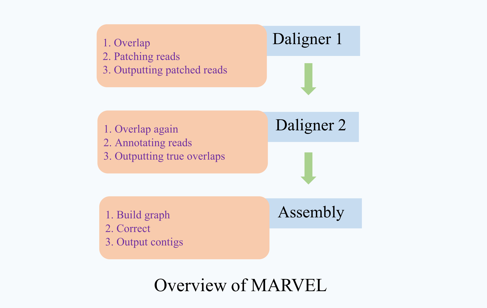

Overview
================================================================================

Scope
--------------------------------------------------------------------------------

The run_marvel package can be applied to the denovo assembly with the PacBio or ONT long reads, given the the relatively high error rates(~15%) of such technologies. With the usage of a dynamic repeat masking server, MARVEL make it feasible to assembly very large repeat-rich genomes.

introduction
--------------------------------------------------------------------------------

The MARVEL assembler currently consists of three major phases namely the setup phase, the patch phase and the assembly phase. In the setup phase the PacBio reads are extracted from the raw sequencing data and saved in an internal database. The patch phase detects and corrects read artifacts including untrimmed adapters, polymerase strand jumps, and ligation chimeras that are the primary impediments to long contiguous assemblies, which are then used for the final assembly phase. In the assembly, phase short alignment artifacts, generally 50 bp, resulting from bad sequencing segments within overlapping read pairs are stitched. This is followed by the repeat annotation and the generation of the overlap graph, which is subsequently toured generating the final assembled contigs.

Reads are overlapped, subsequently patched and overlapped again. The initial overlap does not have to be a full all-against-all comparison, but a partial overlapping run, comparing a block not against all others, but rather just enough (aligning a read to reads summing up to 15x coverage which usually suffices), in order to have enough information for the patching. After the second overlapping run with patched reads, they are annotated (read quality, read trimming, repeat regions). The annotation is then used filter repeat induced alignments, detect chimeras and other read artifacts that could negatively impact the assembly pipeline downstream. After this filtering of alignments, we should be left with only true overlaps, based on which the overlap graph is built and then subsequently toured. The paths through the overlap graph represent the contigs.

It contains the following major features:

1)	A front-to-end assembler of noisy long reads that is not dependent on external toolkits and libraries.

2)	Uncorrected assembly

3)	Read patching (in lieu of correction)

4)	Repeat masking during overlapping

5)	Post-assembly correction

6)	Assembly of uniquely decomposable repeat regions

7)	Post-assembly polishing

For more details, you can refer to the MARVEL paper, we supply the links for it in the **reference** section.

.. _InputOutput:

Input and Output
--------------------------------------------------------------------------------

For the run_marvel package, you have to prepare two files. The first one is 'config.list' file where each line stores the path for the reads files independently. Besides, you have to prepare a 'config.cfg' file, containing sample name, reads.list, output dir and all kinds of parameters.

For more information, you can refer to the part 'Config and Usage' under the section  *Examples* .

.. _Parameters:

Parameters
--------------------------------------------------------------------------------

There are **three main steps** in run_marvel, including dalinger1, daligner2 and assembly. And all the important parameters are saved in the example.cfg file (see more details in the *Example* section). The parameters are shown as followed:

.. csv-table::
   :file: tables/para_summary.tsv
   :delim: tab
   :header-rows: 1
   :widths: 15, 10, 75

