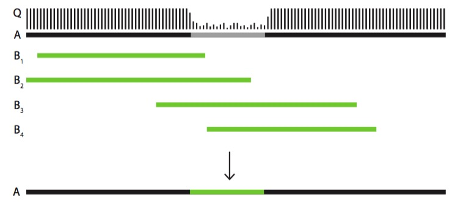

Results
================================================================================

folders
--------------------------------------------------------------------------------

Basically, there are 4 folders, including **1-dalignerOne**, **2-dalignerTwo**, **3-results**, and **4-logs**.
Their introduction is as following tables(same as the table in **Storage** section, 4.6M genome with 50x data):

.. csv-table::
   :file: tables/storage.tsv
   :delim: tab
   :header-rows: 1
   :widths: 15, 10, 75

Patched reads
--------------------------------------------------------------------------------

The patched reads were linked under the folder 3-results, named with the 'fixed.fasta' as ending. Instead of correcting the reads, MARVEl opted for a process that it called patching, which repairs large-scale errors (missed adaptors, large "random" inserts, high-error regions, missiing sequence) that result in a stop of alignment once MARVEL reaches such erroneous regions. The main point here is that when restoring large-scale errors with uncorrected parts of other reads, the sequence used for the correction only needs to be good enough to allow the alignment to continue at the native error rate and does not actually have to be the right one. Patching essentially works by finding regions in the reads that are : a) of low quality. b) not spanned by any alignment. The following figure illustrate a specific patching process:

Assemble sequences
--------------------------------------------------------------------------------

The contig sequences were copy under the folder 3-results, named with the '_FIX.tour.fasta' as ending.

